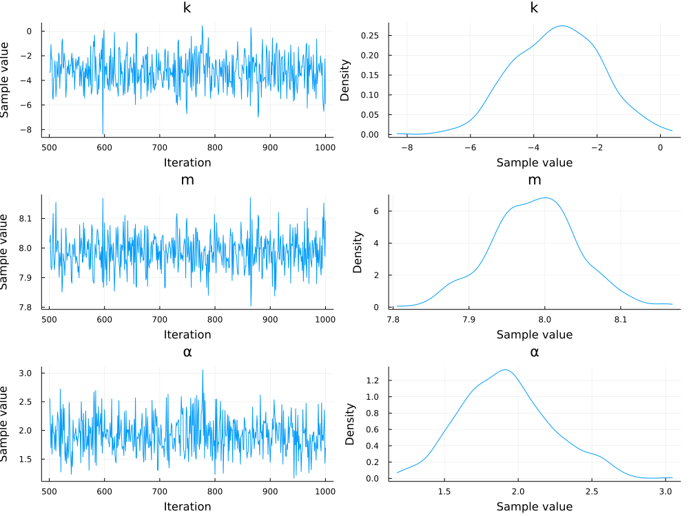
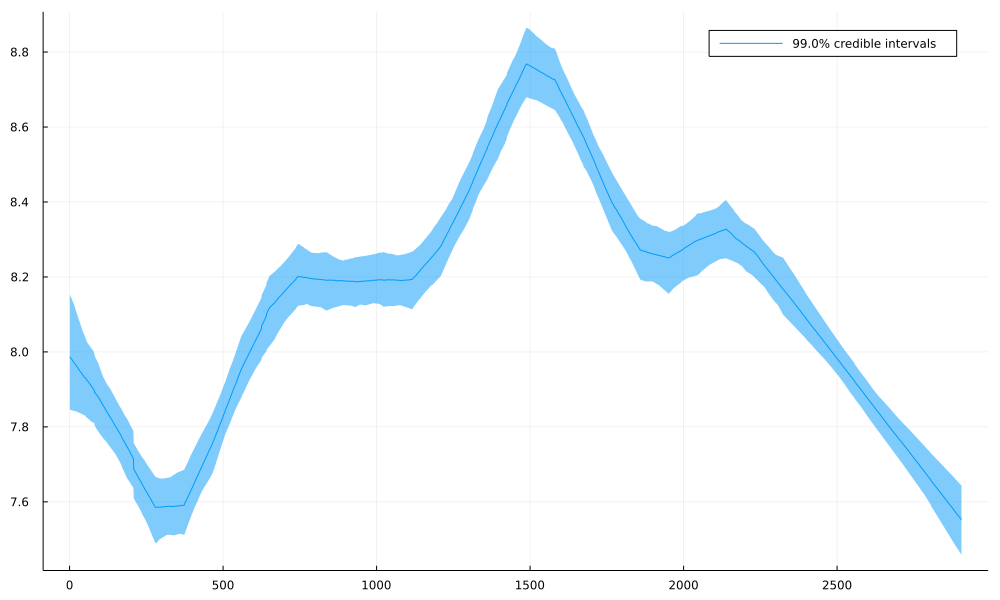

# `Prophet.jl`

A quick and dirty approach to get [`Turing.jl`](https://github.com/TuringLang/Turing.jl) running inference similar to [`prophet`](https://github.com/facebook/prophet/).

## Quickstart

```julia
julia> using Prophet

julia> # Load an example dataset.
       df = Prophet.load_peyton_manning();

julia> # Instantiate the model.
       model = prophet(df);
INFO:prophet:Disabling daily seasonality. Run prophet with daily_seasonality=True to override this.

julia> # [Optional] For much improved performance.
       using ReverseDiff, Memoization

julia> Turing.setadbackend(:reversediff); Turing.setrdcache(true);

julia> # Inference.
       chain = sample(model, NUTS(500, 0.8), 500);
┌ Warning: The current proposal will be rejected due to numerical error(s).
│   isfinite.((θ, r, ℓπ, ℓκ)) = (true, false, false, false)
└ @ AdvancedHMC ~/.julia/packages/AdvancedHMC/HQHnm/src/hamiltonian.jl:47
┌ Warning: The current proposal will be rejected due to numerical error(s).
│   isfinite.((θ, r, ℓπ, ℓκ)) = (true, false, false, false)
└ @ AdvancedHMC ~/.julia/packages/AdvancedHMC/HQHnm/src/hamiltonian.jl:47
┌ Info: Found initial step size
└   ϵ = 0.00625
Sampling 100%|██████████████████████████████████████████████████████████████████████████████████████| Time: 0:03:34

julia> chain[[:k, :m, :α]]
Chains MCMC chain (500×3×1 Array{Float64, 3}):

Iterations        = 501:1:1000
Number of chains  = 1
Samples per chain = 500
Wall duration     = 214.37 seconds
Compute duration  = 214.37 seconds
parameters        = k, m, α
internals         = 

Summary Statistics
  parameters      mean       std   naive_se      mcse        ess      rhat   ess_per_sec 
      Symbol   Float64   Float64    Float64   Float64    Float64   Float64       Float64 

           k   -3.2535    1.3587     0.0608    0.0514   461.6866    0.9983        2.1537
           m    7.9862    0.0581     0.0026    0.0019   544.1207    0.9980        2.5382
           α    1.9190    0.3088     0.0138    0.0165   445.4332    0.9980        2.0779

Quantiles
  parameters      2.5%     25.0%     50.0%     75.0%     97.5% 
      Symbol   Float64   Float64   Float64   Float64   Float64 

           k   -5.7614   -4.2223   -3.2088   -2.2765   -0.6395
           m    7.8692    7.9502    7.9869    8.0231    8.1007
α    1.3584    1.7018    1.9057    2.1207    2.5623


julia> plot(chain[[:k, :m, :α]])
```



We can also take a look at the inferred trends:

```julia
julia> # Inferred trend.
       trends = reduce(hcat, generated_quantities(model, MCMCChains.get_sections(chain, :parameters)));

julia> # Plot it!
       Prophet.plot_quantiles(eachrow(trends))
```


